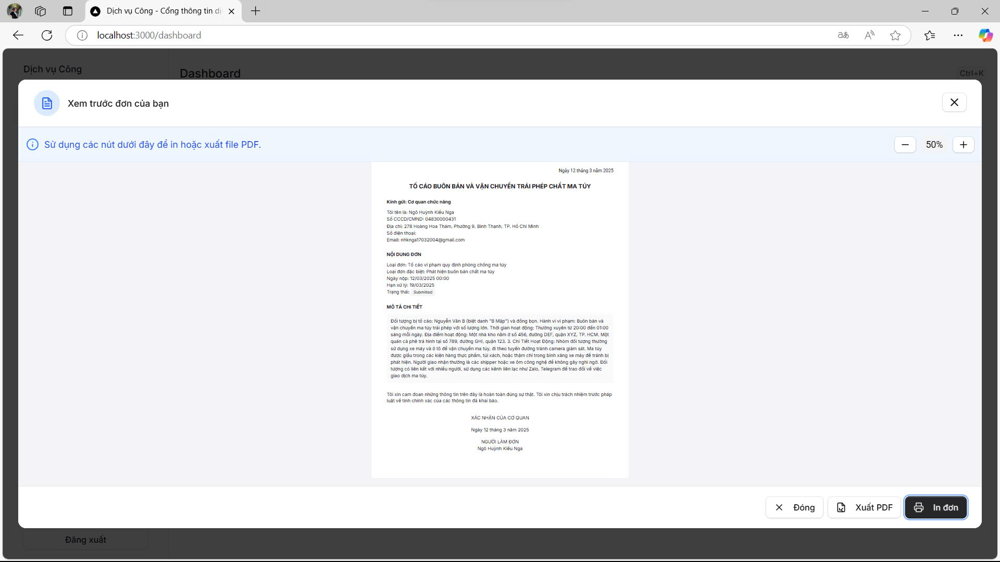
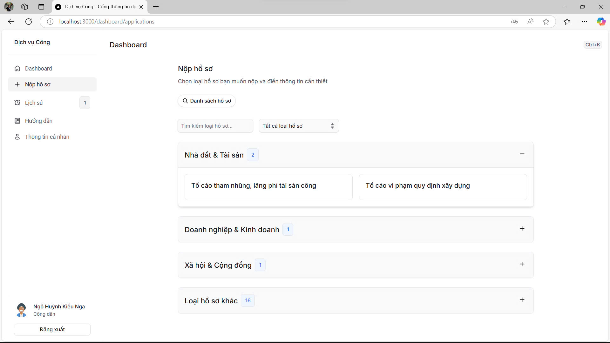
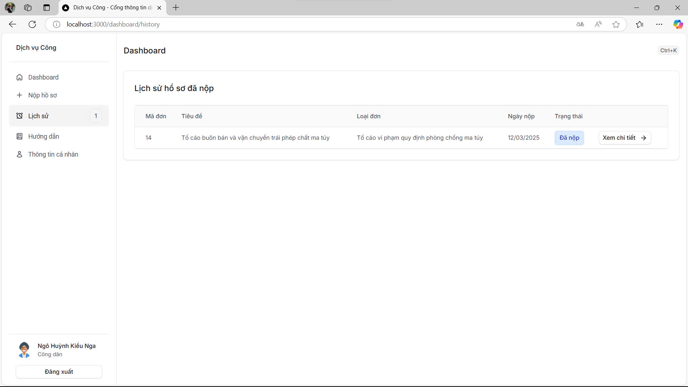
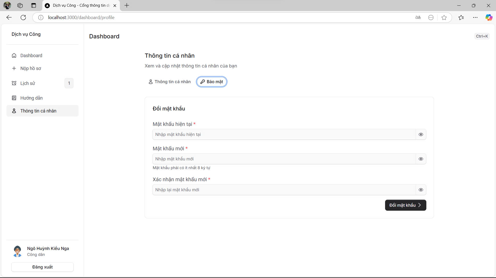
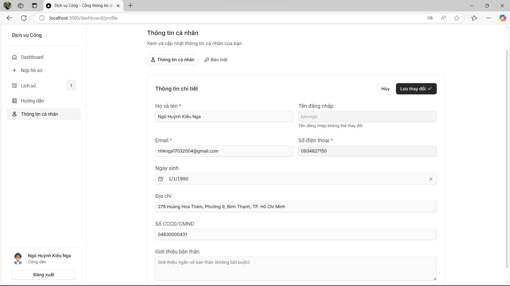
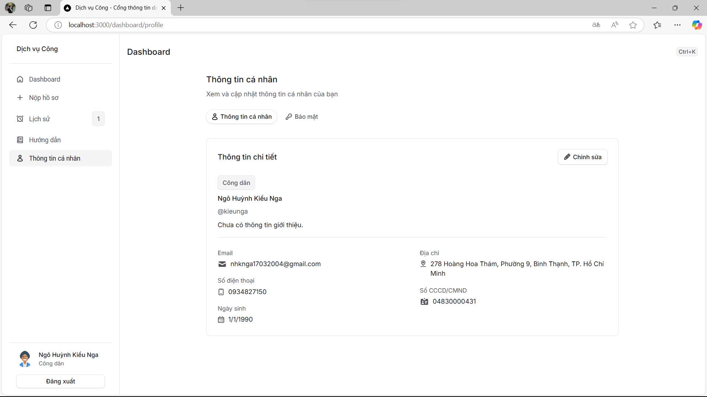
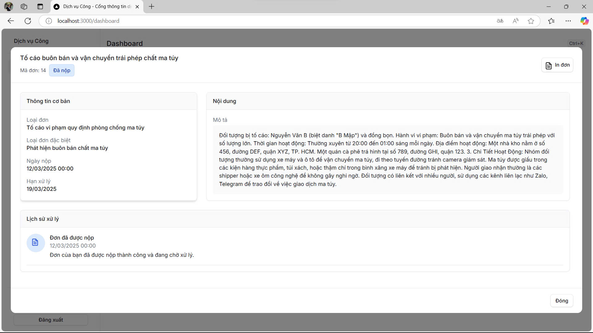
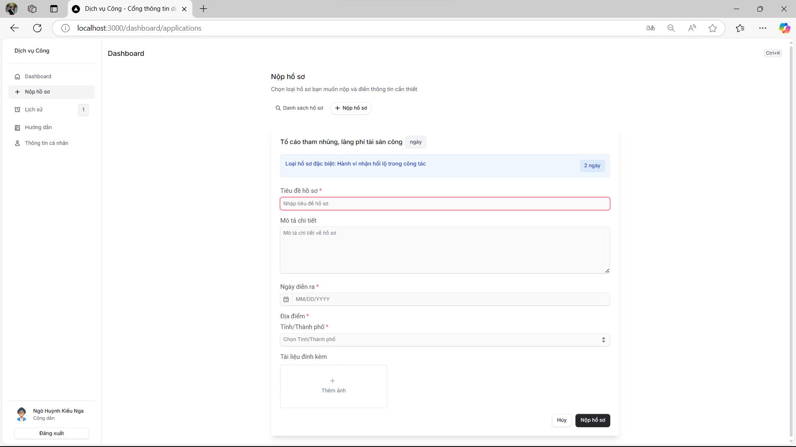
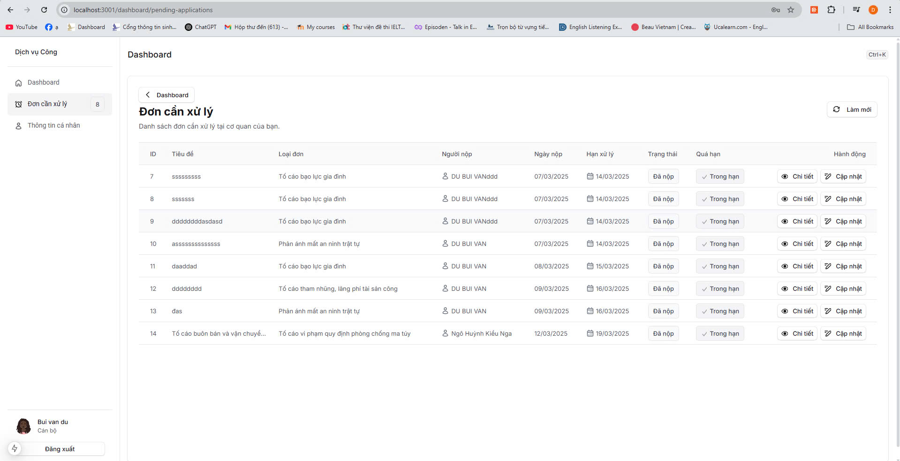

# Hệ thống Quản lý Dịch vụ Hành chính Công

Hệ thống toàn diện để quản lý dịch vụ hành chính công, hỗ trợ tương tác giữa công dân và cơ quan chính phủ.

## Tổng quan dự án

Dự án bao gồm các thành phần chính:

- **Backend (server)**: API RESTful xây dựng trên Express.js, kết nối PostgreSQL và Redis
- **Admin Portal**: Giao diện quản trị dành cho người quản lý hệ thống
- **Citizen Portal**: Cổng dịch vụ công dành cho người dân
- **Staff Portal**: Giao diện dành cho cán bộ, nhân viên cơ quan hành chính
- **Mobile App**: Ứng dụng di động cho người dân xây dựng bằng Flutter

## Công nghệ sử dụng

### Backend
- Node.js & Express.js
- PostgreSQL (cơ sở dữ liệu quan hệ)
- Redis (cache và quản lý phiên)
- Sequelize ORM
- JWT (xác thực)
- Bcrypt (mã hóa)
- Middleware bảo mật: Helmet, XSS-Clean, Rate Limiting

### Frontend
- Next.js (React Framework)
- Tailwind CSS
- TypeScript

### Mobile
- Flutter

## Tính năng chính

- Quản lý hồ sơ công dân
- Xử lý đơn đăng ký dịch vụ công
- Quản lý loại hồ sơ và đơn từ
- Quản lý cơ quan hành chính
- Hệ thống thông báo và theo dõi trạng thái
- Lịch sử xử lý hồ sơ
- Quản lý tài khoản cán bộ
- Thông báo công khai
- Quản lý khu vực địa lý
- Hệ thống bài viết và thông tin

## Cài đặt

### Yêu cầu hệ thống
- Node.js (v14+)
- PostgreSQL
- Redis
- Flutter SDK (cho phát triển mobile)

### Bước 1: Clone Repository

```bash
git clone <git@github.com:Duonganhdu2002/government.git>
cd government
```

### Bước 2: Cấu hình môi trường

Tạo file `.env` trong thư mục `server` và thiết lập các biến môi trường:

```bash
cp server/.env.example server/.env
```

Chỉnh sửa file `.env` với các thông số phù hợp cho:
- Kết nối database
- Cấu hình Redis
- JWT secret
- Cổng server
- CORS settings

### Bước 3: Cài đặt dependencies và khởi chạy server

```bash
# Cài đặt và chạy Backend
cd server
npm install
npm run dev

# Cài đặt và chạy Admin Portal
cd ../admin
npm install
npm run dev

# Cài đặt và chạy Citizen Portal
cd ../citizen
npm install
npm run dev

# Cài đặt và chạy Staff Portal
cd ../staff
npm install
npm run dev

# Cài đặt và chạy Mobile App
cd ../mobile
flutter pub get
flutter run
```

## Cấu trúc thư mục

- `/server`: Backend API
  - `/src`: Mã nguồn
    - `/controllers`: Xử lý logic nghiệp vụ
    - `/models`: Định nghĩa database models
    - `/routes`: Định nghĩa API endpoints
    - `/middleware`: Middleware xác thực và xử lý lỗi
    - `/config`: Cấu hình database và Redis
    - `/utils`: Các tiện ích

- `/admin`: Admin Portal
- `/citizen`: Citizen Portal
- `/staff`: Staff Portal
- `/mobile`: Mobile Application

## Thư viện hình ảnh dự án


<p align="center">
  
</p>

<p align="center">
  
</p>

<p align="center">
  
</p>

<p align="center">
  
</p>

<p align="center">
  
</p>

<p align="center">
  
</p>


<p align="center">
  
</p>

<p align="center">
  
</p>

<p align="center">
  
</p>

<p align="center">
  
</p>


<p align="center">
  
</p>

<p align="center">
  
</p>

<p align="center">
  
</p>

<p align="center">
  
</p>


<p align="center">
  
</p>